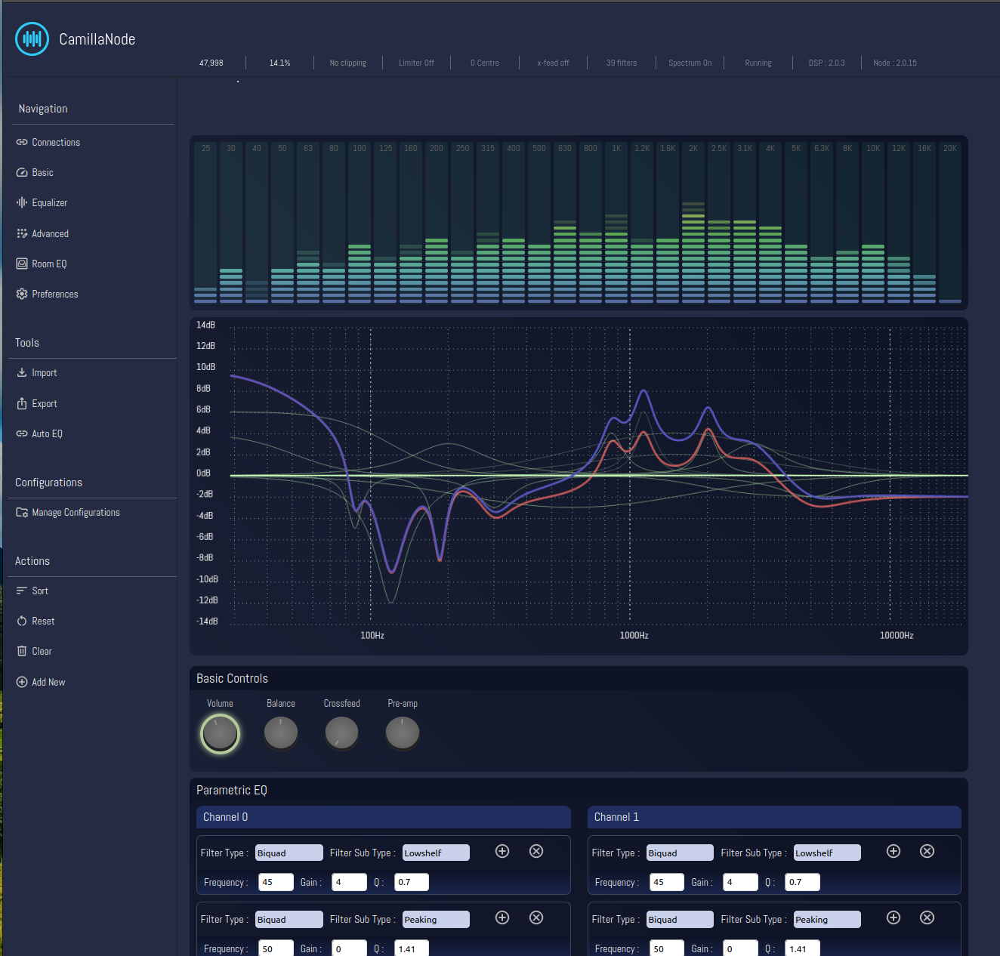
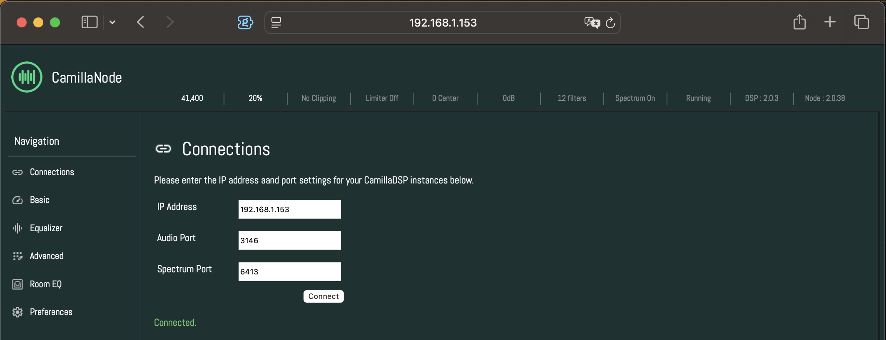
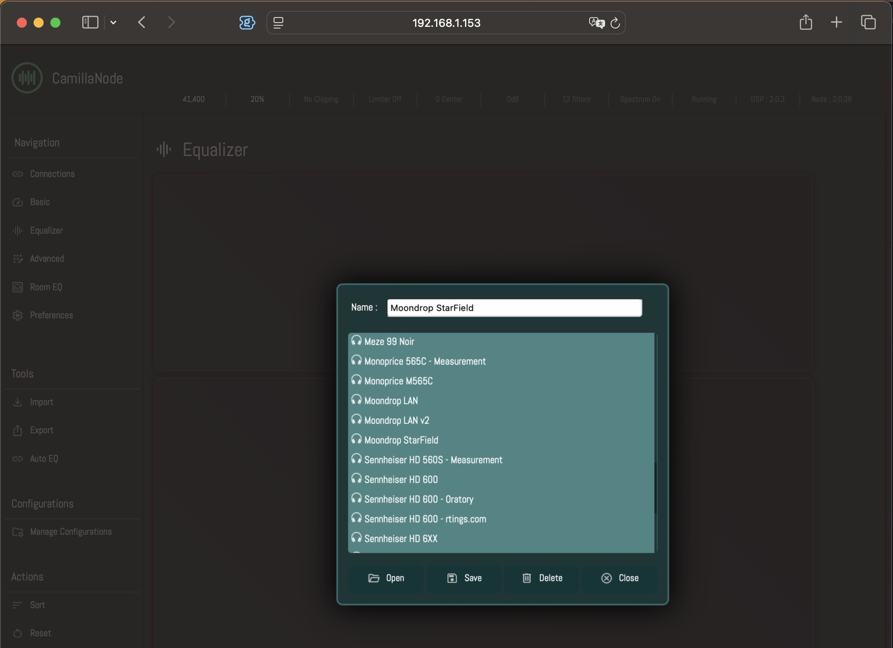
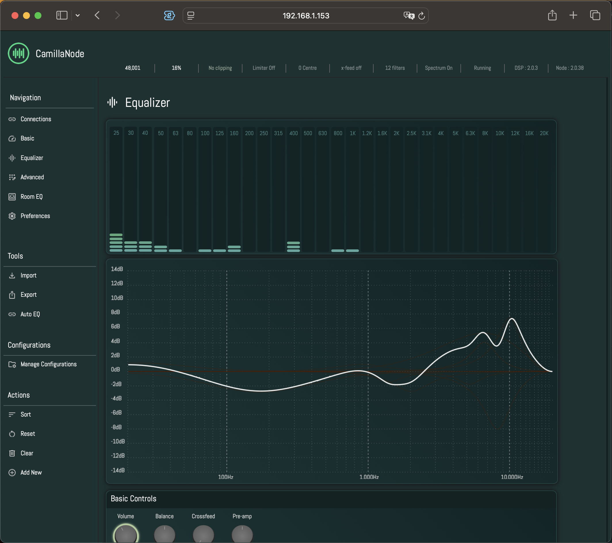
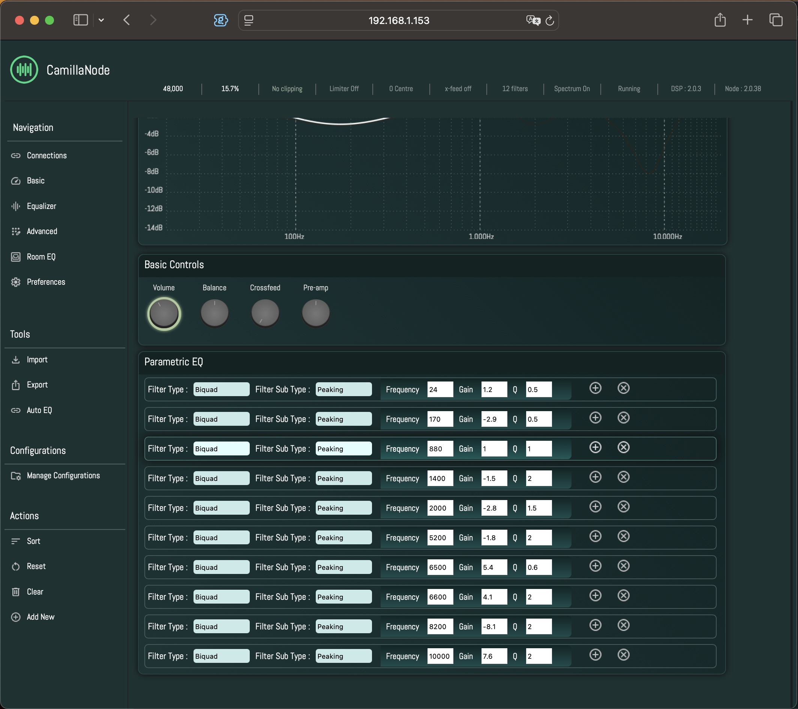
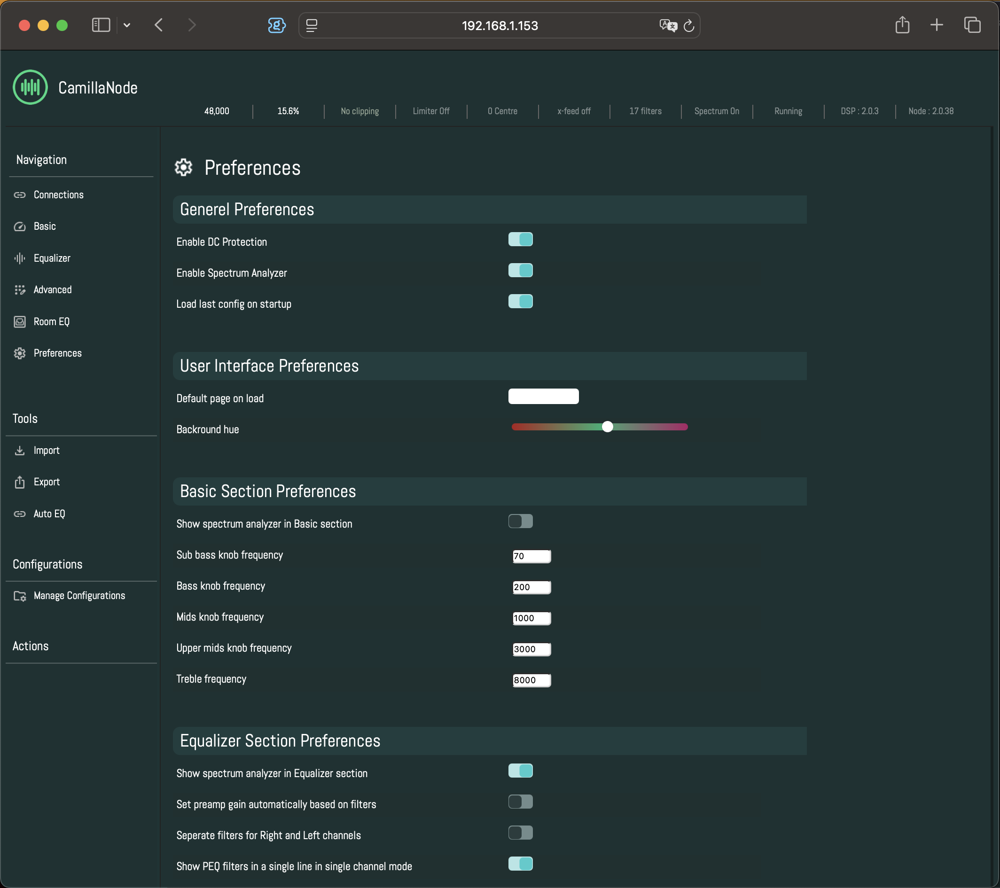
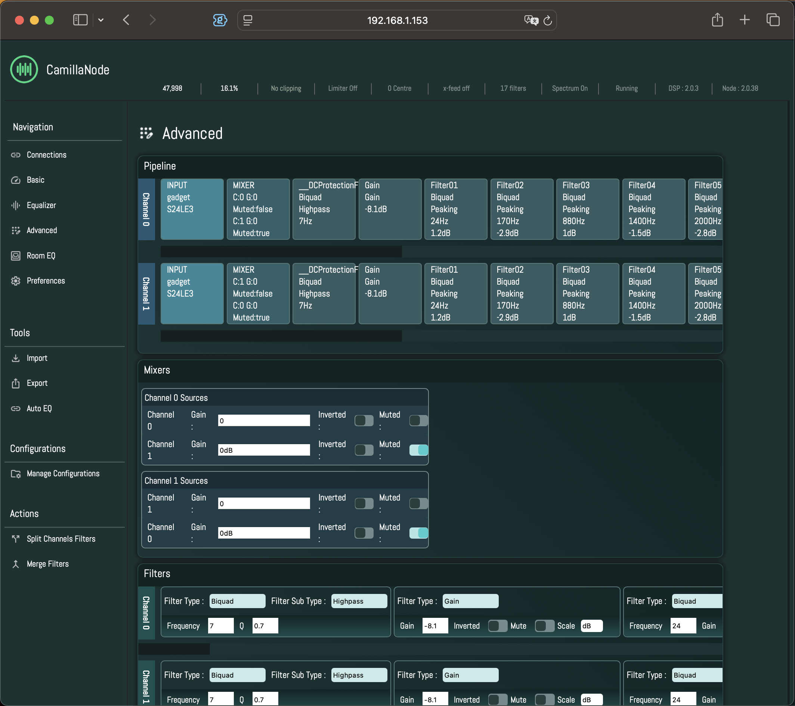

# CamillaNode

### What is CamillaNode?
CamillaNode is a web-based interface to control [CamillaDSP](https://github.com/HEnquist/camilladsp) and use it as an equalizer. It provides a clean, intuitive graphical interface for managing DSP configurations, parametric equalization, tone controls, and more.


*CamillaNode interface with parametric equalizer and tone controls *


## Key Features

- **Parametric Equalizer** - Visual frequency response graph with drag-and-drop filter adjustment
- **AutoEQ Integration** - Load professional headphone/IEM calibration profiles from Oratory1990 and Crinacle databases
- **Basic Tone Controls** - Simple bass, mids, treble adjustments for quick tuning
- **Configuration Management** - Save, load, and organize multiple DSP configurations
- **Real-time Monitoring** - Live status indicators for sample rate, clipping, CPU utilization
- **Theme Customization** - Adjustable colors, fonts, and appearance settings
- **Import/Export** - Compatible with EqualizerAPO, REW, and other EQ formats

### Installation

#### Quick Start

CamillaNode uses Node.js. If you don't have it installed already, you can install it from [here](https://nodejs.org/en/download) or directly from the command line with `sudo apt install npm`.

Installing CamillaNode requires you to download it from GitHub and install required dependencies using NPM, all of which can be achieved as follows:

```bash
git clone https://github.com/ismailAtaman/camillaNode.git camillanode
cd camillanode
npm install
```

To start the web service, just run it with `node .` (admin privileges might be required).

**For detailed installation instructions, including automated setup scripts and service configuration, see [docs/installation.md](docs/installation.md).**

#### First Connection

Once CamillaNode is running, go to the **Connections** tab and enter the connection details:


*Connecting to a CamillaDSP server*

- **Server**: IP address or hostname of the machine running CamillaDSP
- **Port**: WebSocket port (default: 1234)
- **Spectrum Port**: Spectrum analyzer port (default: 1235)

If you don't know the port, check your `camilladsp.service` file in `/lib/systemd/system/camilladsp.service`. The port will be the value that follows the `-p` option. If there is no such file, try `sudo service camilladsp status` to see the path to the service file.

**Important for Remote Access:** If you're running CamillaNode on a separate PC or Mac to control a CamillaDSP on another device, you need to make sure CamillaDSP is initialized with the `-a 0.0.0.0` option. This binds the WebSocket server to the external network interface so you can reach CamillaDSP from another computer on your network.

## Usage

CamillaNode provides multiple interfaces for controlling your DSP. Here's an overview of the main pages:

### Managing Configurations

You can save and load your EQ settings and configurations using the configuration manager:


*Manage Configurations modal - save, load, and organize your DSP presets*

### Equalizer

This is where all the controls happen. The equalizer page provides a visual frequency response graph and full parametric EQ control.


*Parametric equalizer with visual frequency response*


*Equalizer showing multiple filters and their combined response*

The interface should be straightforward to EqualizerAPO users. If not, please do ask! 

For AutoEQ integration:
- **Headphone list** loads AutoEQ settings from Oratory1990's measurements
- **IEM list** loads settings from Crinacle's database

Currently there is no option to change the AutoEQ source, but I'm planning to add that in the future. Once loaded, you can save the EQ settings directly, or make changes and save afterwards. It's your ears and your taste, after all!

### Preferences

This is the page where you can customize the interface:


*Preferences page - customize colors, fonts, and application behavior*

Here you can:
- Change color theme and hue
- Enable/disable functionality
- Adjust font sizes
- Set default page on startup
- Configure other application settings

### Advanced Configuration

For more advanced users who want direct access to CamillaDSP configuration:


*Advanced page - direct configuration editing and pipeline visualization*

### Basic Controls & Device Settings

- **Basic** page: Simple tone controls for bass, mids, treble, plus volume and balance
- **Device** page: Shows basic device settings - not a comprehensive list, just the essentials that are commonly adjusted

**For detailed usage instructions, tips, and best practices, see [docs/user-guide.md](docs/user-guide.md).**

## Running CamillaNode as a Service

You can set up a service to run CamillaNode automatically when the device is booted by following the steps described below:

Create the `camillanode.service` file with your favourite editor, for example nano:

```bash
sudo nano /lib/systemd/system/camillanode.service
```

Enter the following text, change `WorkingDirectory` and `Environment` variables to the path where you saved CamillaNode, save and close:

```ini
[Unit]
Description=camillaNode Service
After=network.target

[Service]
User=root
Group=nogroup
ExecStart=/usr/bin/node /home/rock/camillanode/index.js
WorkingDirectory=/home/**userName**/camillanode/
Environment=PATH=/home/**userName**/camillanode/
Restart=always

[Install]
WantedBy=multi-user.target
```

Afterwards, enable and start the service:

```bash
systemctl enable camillanode
systemctl start camillanode
```

Now CamillaNode service will start automatically after boot.

## Updating CamillaNode

To update CamillaNode, you need to stop the CamillaNode service, download the updated files from GitHub, and restart the service. All of this can be achieved simply with a straightforward bash script, provided below.

Save this script in a `.sh` file (e.g., `update.sh`) and run it with `sudo bash update.sh`.

Before doing so, make sure **username**, **service name**, and **path** are correct:

```bash
#!/bin/bash
echo "This script will update camillaNode from github..."
sudo service camillanode stop
cd /home/<USERNAME>/camillanode/
git pull https://github.com/ismailAtaman/camilllaNode.git
sudo service camillanode start
```

## Documentation

Comprehensive documentation is available in the `docs/` folder:

- **[Installation Guide](docs/installation.md)** - Detailed setup instructions, prerequisites, and automated installation scripts
- **[User Guide](docs/user-guide.md)** - Complete walkthrough of all features, pages, and workflows
- **[Architecture](docs/architecture.md)** - System design, component structure, and technical implementation details
- **[API Reference](docs/api-reference.md)** - HTTP endpoints and WebSocket message formats
- **[Features](docs/features.md)** - Current features and work-in-progress modules

## Support & Contributing

- **Repository**: [https://github.com/ismailAtaman/camillaNode](https://github.com/ismailAtaman/camillaNode)
- **CamillaDSP**: [https://github.com/HEnquist/camilladsp](https://github.com/HEnquist/camilladsp)
- **AutoEQ Database**: [https://github.com/jaakkopasanen/AutoEq](https://github.com/jaakkopasanen/AutoEq)
- **Discussion Forum**: [https://www.audiosciencereview.com/forum/index.php?threads/camillanode-2-web-based-camilladsp-control-ui.54338/](https://www.audiosciencereview.com/forum/index.php?threads/camillanode-2-web-based-camilladsp-control-ui.54338/)

## License

MIT License

Copyright (c) 2022 Ismail Ataman

Permission is hereby granted, free of charge, to any person obtaining a copy
of this software and associated documentation files (the "Software"), to deal
in the Software without restriction, including without limitation the rights
to use, copy, modify, merge, publish, distribute, sublicense, and/or sell
copies of the Software, and to permit persons to whom the Software is
furnished to do so, subject to the following conditions:

The above copyright notice and this permission notice shall be included in all
copies or substantial portions of the Software.

THE SOFTWARE IS PROVIDED "AS IS", WITHOUT WARRANTY OF ANY KIND, EXPRESS OR
IMPLIED, INCLUDING BUT NOT LIMITED TO THE WARRANTIES OF MERCHANTABILITY,
FITNESS FOR A PARTICULAR PURPOSE AND NONINFRINGEMENT. IN NO EVENT SHALL THE
AUTHORS OR COPYRIGHT HOLDERS BE LIABLE FOR ANY CLAIM, DAMAGES OR OTHER
LIABILITY, WHETHER IN AN ACTION OF CONTRACT, TORT OR OTHERWISE, ARISING FROM,
OUT OF OR IN CONNECTION WITH THE SOFTWARE OR THE USE OR OTHER DEALINGS IN THE
SOFTWARE.
